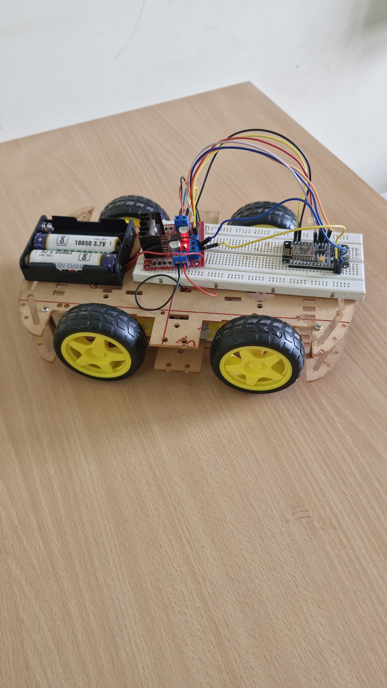

# gesture_control_car


# 🤖 Gesture Controlled Robot (Wi-Fi Based)

This project enables real-time robot control using **hand gestures** detected via a webcam, powered by **OpenCV**, **MediaPipe**, and **ESP8266 Wi-Fi communication**. It offers contactless control of a robot car using just your fingers, without needing any physical controller or additional sensors.

---

## 🚀 Features

- ✋ Real-time hand gesture recognition using **MediaPipe**
- 📡 Wireless command transmission via **UDP over Wi-Fi**
- ⚙️ ESP8266 + L298N motor driver to control a 2WD robot
- 👊 0 to 4 fingers mapped to intuitive motion commands
- 📷 Visual feedback on-screen showing detected gestures

---

## 🖐 Gesture to Command Mapping

| Gesture            | Finger Count | Action    | Command Sent |
|--------------------|--------------|-----------|---------------|
| ✊ Fist           | 0            | Stop      | `"0"`         |
| ☝️ One finger     | 1            | Forward   | `"1"`         |
| ✌️ Two fingers    | 2            | Left      | `"2"`         |
| 🤟 Three fingers  | 3            | Right     | `"3"`         |
| ✋ Four fingers   | 4            | Backward  | `"4"`         |

---

## 🛠 Hardware Requirements

- ESP8266 (NodeMCU or similar)
- L298N Motor Driver Module
- 2 DC Motors with chassis
- Power supply (e.g., 9–12V battery)
- PC/Laptop with webcam
- Wi-Fi hotspot or router for connectivity

---

## 🧠 Software Stack

- Python 3.x
- OpenCV
- MediaPipe
- socket (for UDP communication)
- Arduino IDE (for ESP8266 firmware)

---

## 📷 Hardware Images

| Side View | Front View |
|-----------|------------|
|  |  |

---

## 📦 Installation & Setup

### 1. Python Environment

```bash
pip install opencv-python mediapipe
```

### 2. ESP8266 Arduino Code

Upload the ESP8266 code via Arduino IDE using matching UDP port (`4210`) and your Wi-Fi SSID/password.

### 3. Python Script (`Gesturecontrol.py`)

Update this line in the script:

```python
UDP_IP = "your_esp8266_ip"
```

Run the script:

```bash
python Gesturecontrol.py
```
## 🎥 Demo Videos

### 🔹 Real-Time Gesture Control
[▶️ Watch Controlling Video](VID-20250720-WA0001.mp4)

### 🔹 Hardware Working Prototype
[▶️ Watch Hardware Video](VID-20250720-WA0002.mp4)
---

## 👨‍💻 Author

**Nikshith Burla**  
GitHub: [@nikshith9999](https://github.com/nikshith9999)

---
